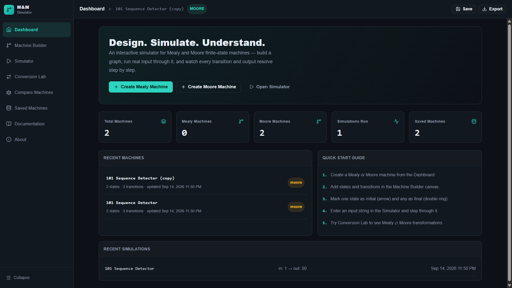
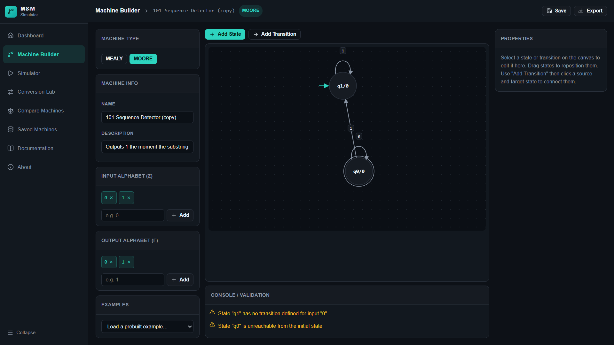
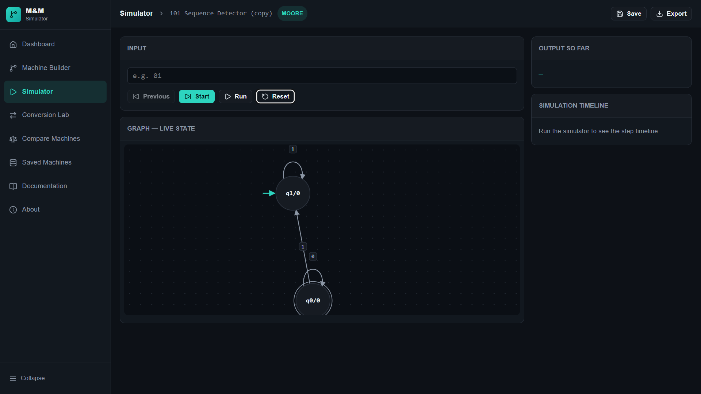
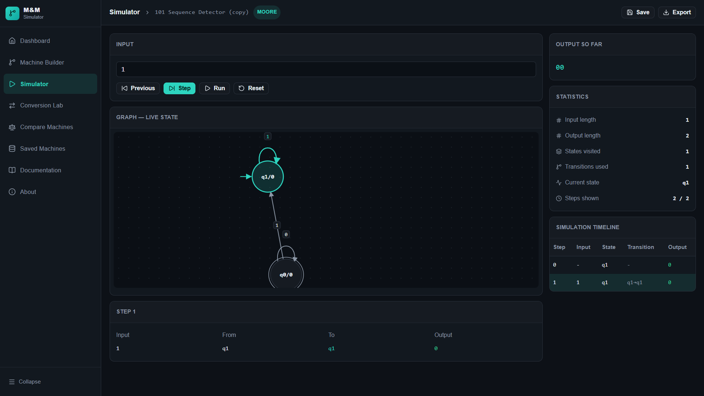
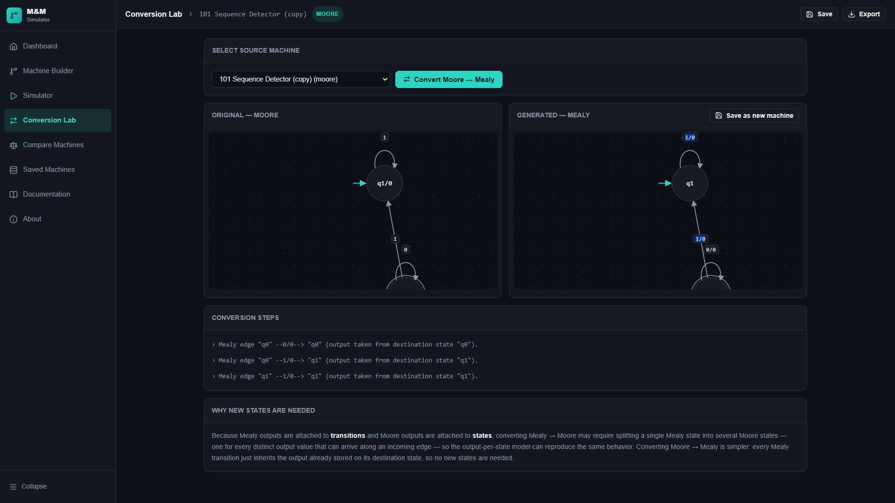
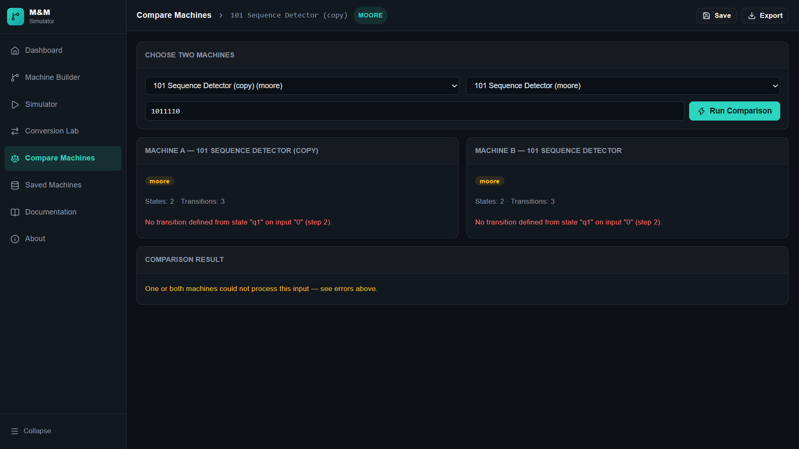

# 🔄 Mealy–Moore Machine Simulator

<p align="center">
  <b>An interactive web-based simulator for designing, visualizing, simulating, converting, and comparing Mealy and Moore Machines.</b>
</p>

<p align="center">
  
  
  
  
</p>


---

## 🌐 Live Demo

> 🚀 **Deployed Project:**


🔗 **Live Demo:** https://mealy-moore-machine-simulator.onrender.com/

---

## 📌 About The Project

**Mealy–Moore Machine Simulator** is an interactive educational web application designed to make **Theory of Computation, Automata Theory, and Finite State Machines** easier to understand through practical visualization.

The application provides an interactive environment where users can:

* 🏗️ Build Mealy and Moore Machines
* 🔗 Create states and transitions
* ▶️ Simulate input strings
* 📊 View step-by-step execution
* 🔄 Convert Mealy Machines to Moore Machines
* ⚖️ Compare machines
* ✅ Validate machine configurations
* 💾 Save machine configurations
* 📥 Import and export machine data

The project combines theoretical concepts with an interactive interface so students can understand how finite-state machines behave during execution.

---

## 🎯 Project Objectives

The main objectives of this project are:

1. Provide an interactive platform for designing finite-state machines.
2. Simulate Mealy and Moore Machines.
3. Visualize state transitions and machine execution.
4. Demonstrate Mealy-to-Moore conversion.
5. Compare machine structures and behavior.
6. Help students understand sequential machines practically.
7. Provide an easy-to-use educational tool for Theory of Computation.

---

# ✨ Features

## 🏠 Dashboard

A centralized dashboard that provides quick access to the major modules of the simulator.

---

## 🛠️ Machine Builder

Create and configure your own finite-state machines.

### Supported operations:

* Add states
* Remove states
* Set initial state
* Set final state
* Add transitions
* Define input symbols
* Define output symbols
* Validate machine structure

---

## ▶️ Machine Simulator

Enter an input string and execute the selected machine.

The simulator displays:

* Current state
* Input symbol
* Transition
* Generated output
* State sequence
* Step-by-step execution
* Final result

### Example Input

```text
010101
```

The simulator processes the input sequentially and displays the corresponding state transitions and outputs.

---

## 🔄 Mealy → Moore Conversion

The **Conversion Lab** demonstrates the conversion of a Mealy Machine into a Moore Machine.

It helps students understand:

* State splitting
* Output assignment
* Transition transformation
* Resulting Moore Machine structure

---

## ⚖️ Machine Comparison

Compare two finite-state machines based on their:

* States
* Transitions
* Input/output behavior
* Machine structure

This provides a practical way to study the differences between machines.

---

## 💾 Saved Machines

Created machine configurations can be saved and reused later.

This makes it easier to:

* Store previously created machines
* Reopen configurations
* Continue experimentation
* Maintain multiple machine designs

---

## 📥 Import / Export

Machine configurations can be imported and exported using **JSON data**.

This allows users to save machine definitions and transfer them between sessions.

---

# 🧠 Mealy Machine

A **Mealy Machine** is a finite-state machine where the output depends on both the **current state and the input**.

### Basic Representation

```text
Current State + Input → Output + Next State
```

### Example

```text
q0 -- 1/0 --> q1
```

Where:

* `q0` → Current State
* `1` → Input
* `0` → Output
* `q1` → Next State

In a Mealy Machine, outputs are associated with **transitions**.

---

# 🧠 Moore Machine

A **Moore Machine** is a finite-state machine where the output depends only on the **current state**.

### Basic Representation

```text
Current State → Output
```

### Example

```text
q0 / 0
```

Where:

* `q0` → State
* `0` → Output

In a Moore Machine, outputs are associated with **states**.

---

# 🔄 Mealy vs Moore

| Feature                | Mealy Machine   | Moore Machine  |
| ---------------------- | --------------- | -------------- |
| Output depends on      | State + Input   | State          |
| Output associated with | Transition      | State          |
| Output changes         | With transition | With state     |
| Number of states       | Usually fewer   | Usually more   |
| Representation         | Input / Output  | State / Output |

---

# 📸 Screenshots

## 🏠 Dashboard

<p align="center">
  
</p>

---

## 🛠️ Machine Builder

<p align="center">
  
</p>

---

## ▶️ Simulator

<p align="center">
  
</p>

---

## 📊 Simulation Result

<p align="center">
  
</p>

---

## 🔄 Conversion Lab

<p align="center">
  
</p>

---

## ⚖️ Machine Comparison

<p align="center">
  
</p>

---

# 🛠️ Technology Stack

### Frontend

* ⚛️ **React**
* ⚡ **Vite**
* 🟨 **JavaScript (ES6+)**
* 🎨 **CSS3**
* 🧩 **HTML5**

### UI / Icons

* **Lucide React**

### Data Handling

* **JSON-based machine configuration**
* Browser-side application state management

---

# 📂 Project Structure

```text
mealy-moore-machine-simulator/
│
├── public/
│
├── screenshots/
│   ├── dashboard.png
│   ├── machine-builder.png
│   ├── simulator.png
│   ├── simulation-result.png
│   ├── conversion.png
│   └── comparison.png
│
├── src/
│   ├── App.jsx
│   ├── App.css
│   ├── index.css
│   └── main.jsx
│
├── .gitignore
├── index.html
├── package.json
├── package-lock.json
├── vite.config.js
└── README.md
```

---

# ⚙️ Installation

## 1. Clone the Repository

```bash
git clone https://github.com/prachi-ankush-3/mealy-moore-machine-simulator.git
```

## 2. Navigate to the Project

```bash
cd mealy-moore-machine-simulator
```

## 3. Install Dependencies

```bash
npm install
```

## 4. Start the Development Server

```bash
npm run dev
```

The application will normally be available at:

```text
http://localhost:5173
```

---

# 🚀 Usage

### Step 1 — Open the Dashboard

Launch the application and access the main dashboard.

### Step 2 — Build a Machine

Open **Machine Builder** and select:

* Mealy Machine
* Moore Machine

### Step 3 — Add States

Create states such as:

```text
q0
q1
q2
```

Set the required initial and final states.

### Step 4 — Add Transitions

For a Mealy Machine, define transitions using:

```text
Input / Output
```

Example:

```text
0 / 1
1 / 0
```

### Step 5 — Validate

Validate the machine to identify incomplete or invalid configurations.

### Step 6 — Simulate

Enter an input string such as:

```text
010101
```

Run the simulation and observe:

* State transitions
* Generated outputs
* Execution steps
* Final result

### Step 7 — Convert

Open **Conversion Lab** to convert a Mealy Machine into a Moore Machine.

### Step 8 — Compare

Use **Compare Machines** to analyze two machines.

---

# 🎓 Academic Applications

This project can be used for:

* Theory of Computation
* Automata Theory
* Finite State Machines
* Computer Science Laboratories
* Academic Demonstrations
* Mini Projects
* Viva Presentations
* Practical Learning

---

# 🔮 Future Scope

The project can be extended with:

* 🔄 Moore → Mealy conversion
* 🤖 DFA/NFA simulator
* 🧮 Regular Expression → Automata conversion
* ✂️ DFA minimization
* 📐 State diagram generation
* 📤 State diagram export
* 🔍 Advanced equivalence checking
* 👤 User authentication
* ☁️ Cloud storage
* 📚 More automata algorithms
* 📊 Advanced machine analysis

---

# 💡 Why This Project?

Traditional Theory of Computation learning often relies heavily on diagrams, tables, and manual calculations.

This simulator provides a **visual and interactive approach** where users can directly:

```text
BUILD
  ↓
VALIDATE
  ↓
SIMULATE
  ↓
VISUALIZE
  ↓
CONVERT
  ↓
COMPARE
```

This makes abstract finite-state machine concepts easier to experiment with and understand.

---

# 👩‍💻 Author

### Prachi Ankush

**B.Tech Computer Engineering**
**Vishwakarma Institute of Technology, Pune**

GitHub:
https://github.com/prachi-ankush-3

---

# ⭐ Project Highlights

> An interactive platform to **build, simulate, visualize, convert, and compare Mealy and Moore Machines**.

### Built for learning. Designed for experimentation. 🚀

---

# 📄 License

This project is developed for **educational and academic purposes**.

---

<p align="center">
  ⭐ If you found this project useful, consider giving it a star!
</p>

<p align="center">
  Made with ❤️ for Theory of Computation
</p>
